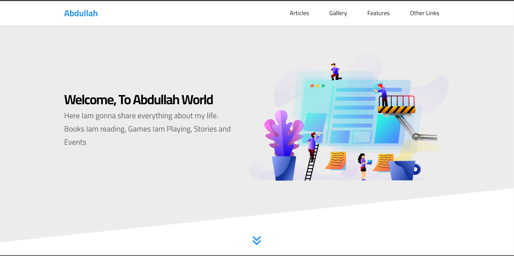

<p align="center">
  
</p>

<h1 align="center">My Super Cool Website</h1>

<p align="center">
  A stunning website showcasing my HTML, CSS, and JavaScript skills with a touch of creativity.
</p>

<p align="center">
  
  <strong>Clean Design</strong> |
  
  <strong>Responsive Layout</strong> |
  
  <strong>Smooth Animations</strong>
</p>

<p align="center">
  
  
  
</p>

## 🚀 Get Started

### Installation

1. Clone the repository to your local machine:

   ```shell
   git clone https://github.com/ABDULLAHRH1/HTML_And_CSS_Template_Three.git
make htis one the smae as that onw
